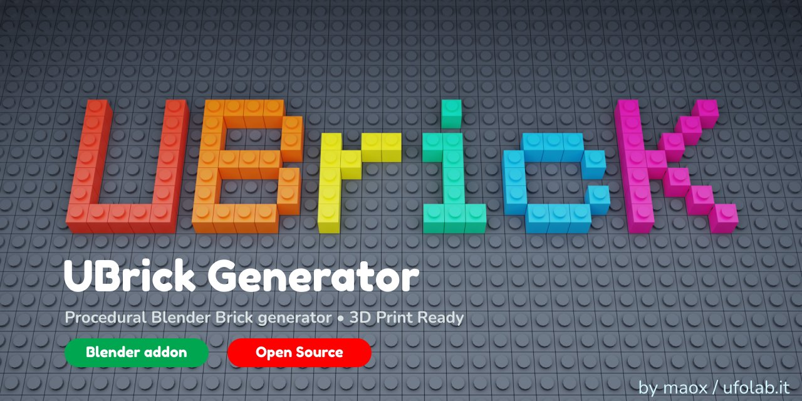

# uBrick Generator




> A Blender add-on to generate procedural LEGO®-compatible bricks — manifold, print-ready, no Boolean ops needed.

**Current version: 0.9** — All normals correct, slicer-ready, zero open edges.

---

## Features

- Parametric brick generation: any size from 1×1 to 32×32, stackable heights
- Fully manifold mesh (0 open edges) — works in PrusaSlicer, Cura, Bambu Studio out of the box
- Correct face normals on every surface — no blue faces, no slicer artifacts
- Hollow shell with real wall thickness (LEGO-spec 1.2 mm)
- Closed top plate (solid box, 1.2 mm thick)
- Anti-stud tubes for proper brick-to-brick connection
- Internal ribs between tubes
- Tolerance parameters exposed in the F9 panel for tuning to your printer and filament

---

## Installation

1. Download `ubrick_generator.py`
2. In Blender: **Edit → Preferences → Add-ons → Install**
3. Select `ubrick_generator.py` and enable it
4. The operator appears under **Add → Mesh → uBrick**

---

## Usage

1. Press **Shift+A → Mesh → uBrick**
2. Adjust parameters in the **F9** panel (bottom-left after placing):

| Parameter | Default | Description |
|---|---|---|
| Larghezza (stud) | 4 | Width in studs |
| Lunghezza (stud) | 2 | Length in studs |
| Altezza (mattoni) | 1 | Height in brick units |
| Espansione pareti | 0.20 mm | Outer wall tolerance |
| Espansione tubi | 0.30 mm | Anti-stud tube tolerance |
| Espansione stud | 0.10 mm | Stud tolerance |

---

## LEGO® Dimensions (reference)

| Constant | Value |
|---|---|
| Grid unit | 8.0 mm |
| Stud radius | 2.4 mm |
| Stud height | 1.6 mm |
| Brick height | 9.6 mm |
| Wall thickness | 1.2 mm |
| Tube outer radius | 3.25 mm |
| Tube inner radius | 2.5 mm |

---

## Recommended tolerances

Tested on **Prusa MK3** with **PETG**:

```
Outer expand:  0.20 mm
Tube expand:   0.30 mm  
Stud expand:   0.10 mm
```

You may need to adjust these for different printers or materials. Print a 2×2 test brick first.

---

## Print settings (Prusa MK3 / PETG)

- Layer height: 0.2 mm
- Infill: 20% (gyroid)
- Perimeters: 3
- No supports needed
- Orient with studs facing up

---

## Requirements

- Blender 3.0 or later
- Python 3.10+ (bundled with Blender)

---

## License

GPL v3 — see [LICENSE](LICENSE)

---

## Disclaimer

LEGO® is a trademark of the LEGO Group, which does not sponsor, authorize or endorse this project.

---

*Made with ❤️ by [maox](https://ufolab.it)*
